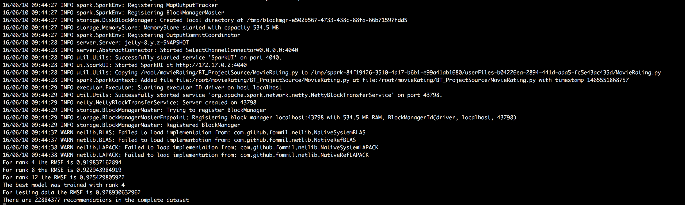

# Movie Recommendation System
Movie Rating with Collaborative Filtering.   Featuring two ways of implementation -
`Python + PySpark'  &  'Scala + Spark`

### Environment: Docker setup
First, download docker image,
For scala, we use official CDH 5.7 docker image which is latest at the moment
```shell
docker pull cloudera/quickstart:latest
```
For python, WE use _Customized cloudera/quickstart image: upgrade python to 2.7.11_ (CDH 5.7 has python 2.6 which could be problematic for using libs such as numpy)
```shell
docker pull /movierating:v1
```

Step 2, start docker vm
```shell
docker-machine start default
eval "$(docker-machine env default)"
```

Step 3, start docker
scala:
```shell
docker run --hostname=quickstart.cloudera --privileged=true -t -i -p 18888:18888 -p 10080:10080 -p 17180:17180 -p 7180:7180 -p 4040:4040 -p 8888:8888 -p 80:80 -m 8192m -v /Users/joshua/Ideas:/repo cloudera/quickstart /usr/bin/docker-quickstart --name=cdh
```
python:
```shell
docker run --hostname=quickstart.cloudera --privileged=true -t -i -p 18888:18888 -p 10080:10080 -p 17180:17180 -p 7180:7180 -p 4040:4040 -p 8888:8888 -p 80:80 -m 8192m -v /Users/joshua/Ideas:/repo joshua/movierating:v1 /usr/bin/docker-quickstart --name=cdh
```

Step 4:
on docker terminal, start CDH services
```shell
/home/cloudera/cloudera-manager --express --force
```
connect to Cloudera manager on http://192.168.99.100:7180/
```shell
[root@quickstart /]# sudo -u hdfs hadoop fs -chmod 777 /user/spark
[root@quickstart /]# sudo -u spark hadoop fs -chmod 777 /user/spark/applicationHistory
```
On Cloudera Manager, start services in the order below:
HDFS
Hive
YARN
Spark

For `Bad health: Clock Offset` problem, disable the warning:
Cloudera Manager → Configuration
Host Clock Offset Thresholds
「Warning」「Critical」→「Never
「Save Changes」


## Python + PySpark implementation

### Files
_DataDownload.py_ download data from movielens website and store the data at the local file system
_MovieRating.py_ load the file in the HDFS file system and build the latent factor CF model
_recommenderSystem.py_ make recommendations to the new user
### Steps to run the program
- First step
```shell
spark-submit --driver-memory 4g DataDownload.py
```
The movielens data will be downloaded to the local file system (in a new folder "./datasets")

- Second step
```shell
hadoop fs -put datasets
hadoop fs -mkdir models
hadoop fs -mkdir checkpoint
```
Put the local folder "./datasets" into the HDFS; make a new folder in HDFS to store the final model trained; checkpoint is used to avoid stackover flow

- Third step
```shell
spark-submit --driver-memory 4g MovieRating.py
```
_Note the size of driver memory can be further increased depending on the OS memory size_
Train the model; choose the parameters according the results on validation set;
result is as below



## Scala + Spark implementation
_MovieRater.scala_ trains mode, evaluates and selects best model based on user ratings. Further more, recommend movies to user based existing rating records from user.

### Prerequisitives:

  * Cloudera Quickstart 5.7 docker
  * scala 2.10
  * maven
  * wget

### Run
- First step
```shell
wget http://files.grouplens.org/datasets/movielens/ml-latest-small.zip
unzip ml-latest-small.zip
wget http://files.grouplens.org/datasets/movielens/ml-latest.zip
unzip ml-latest.zip
```
The movielens data will be downloaded to the current dir and unzipped into separate folders

- Second step
```shell
hadoop fs -mkdir -p /tmp/mydata/movielens/small/
hadoop fs -copyFromLocal  ml-latest-small/*.csv /tmp/mydata/movielens/small/
hadoop fs -mkdir -p /tmp/mydata/movielens/user-profile
hadoop fs -copyFromLocal /repo/bt-hollywood/src/main/resources/user-profile/batch*.csv /tmp/mydata/movielens/user-profile/
hadoop fs -mkdir -p /tmp/mydata/movielens/big/
hadoop fs -copyFromLocal  ml-latest/ratings.csv /tmp/mydata/movielens/big/
```
Make new folders in HDFS and copy ratings.csv over

- Third step
  - run on small dataset :
```shell
spark-submit --master yarn-client --class io.bittiger.movierating.hollywood.MovieRater hollywood-1.0-SNAPSHOT-jar-with-dependencies.jar  /tmp/mydata/movielens/small/ratings.csv /tmp/mydata/movielens/small/movies.csv /tmp/mydata/movielens/user-profile/batch_1.csv 997
```
  - run on large dataset :
```shell
spark-submit --master yarn-client --class io.bittiger.movierating.hollywood.MovieRater hollywood-1.0-SNAPSHOT-jar-with-dependencies.jar  /tmp/mydata/movielens/big/ratings.csv /tmp/mydata/movielens/small/movies.csv /tmp/mydata/movielens/user-profile/batch_2.csv 999
```

### Result example
```
Got 22884377 ratings from 247753 users on 33670 movies.
Training: 13729614, validation: 4580902, test: 4573861
RMSE (validation) = 0.8258453994610284 for the model trained with rank = 8, lambda = 0.1, and numIter = 10.
RMSE (validation) = 0.8214951299457715 for the model trained with rank = 8, lambda = 0.1, and numIter = 20.
RMSE (validation) = 3.681021156174323 for the model trained with rank = 8, lambda = 10.0, and numIter = 10.
RMSE (validation) = 3.681021156174323 for the model trained with rank = 8, lambda = 10.0, and numIter = 20.
RMSE (validation) = 0.8205171634436613 for the model trained with rank = 12, lambda = 0.1, and numIter = 10.
RMSE (validation) = 0.818235041472173 for the model trained with rank = 12, lambda = 0.1, and numIter = 20.
RMSE (validation) = 3.681021156174323 for the model trained with rank = 12, lambda = 10.0, and numIter = 10.
RMSE (validation) = 3.681021156174323 for the model trained with rank = 12, lambda = 10.0, and numIter = 20.
The best model was trained with rank = 12 and lambda = 0.1, and numIter = 20, and its RMSE on the test set is 0.8185896948127657.
The best model improves the baseline by 77.77%.

============>>>> Movies recommended for User... <<<<=================
 1: 21 Up (1977)
 2: 12 Years a Slave (2013)
 3: Sympathy for Mr. Vengeance (Boksuneun naui geot) (2002)
 4: "Magic Flute
 5: Grand Illusion (La grande illusion) (1937)
 6: 28 Up (1985)
 7: Cold Fish (Tsumetai nettaigyo) (2010)
 8: Symbol (Shinboru) (2009)
 9: Never Sleep Again: The Elm Street Legacy (2010)
10: Cowboy Bebop (1998)
11: Dolls (2002)
12: Hud (1963)
13: Black Dynamite (2009)
14: "Education
15: House of Sand and Fog (2003)
16: Fireworks (Hana-bi) (1997)
17: "Old Man and the Sea
18: Joyeux Noël (Merry Christmas) (2005)
19: 35 Up (1991)
20: Red Road (2006)
21: "Queen of Versailles
22: Blue Jasmine (2013)
23: "Help
24: Garden State (2004)
25: Evil Dead II (Dead by Dawn) (1987)
26: "Apartment
27: Batman Beyond: Return of the Joker (2000)
28: "OSS 117: Cairo
29: Fist of Legend (Jing wu ying xiong) (1994)
30: Schizopolis (1996)
31: Land and Freedom (Tierra y libertad) (1995)
32: Holy Motors (2012)
33: Wallace & Gromit: The Best of Aardman Animation (1996)
34: Kids Return (Kizzu ritân) (1996)
35: Getting Any? (Minnâ-yatteruka!) (1994)
36: Adrift in Tokyo (Tenten) (2007)
37: Achilles and the Tortoise (Akiresu to kame) (2008)
38: Crawlspace (1986)
39: "Killer Inside Me
40: Starman (1984)
41: 2001: A Space Odyssey (1968)
42: "Dead Zone
43: D.A.R.Y.L. (1985)
44: My Favorite Year (1982)
45: Being There (1979)
46: Koyaanisqatsi (a.k.a. Koyaanisqatsi: Life Out of Balance) (1983)
47: "Wicker Man
48: Stardust Memories (1980)
49: Of Mice and Men (1992)
50: Batman: Mask of the Phantasm (1993)
```

### Reference  ###
* [Collaborative Filtering - spark.mllib](http://spark.apache.org/docs/latest/mllib-collaborative-filtering.html)
* [Source code of Databricks ML training on ALS](https://github.com/databricks/spark-training/blob/master/machine-learning/scala/solution/MovieLensALS.scala)
* [Spark summit 2014 Hands-on Exercises](https://databricks-training.s3.amazonaws.com/index.html)


